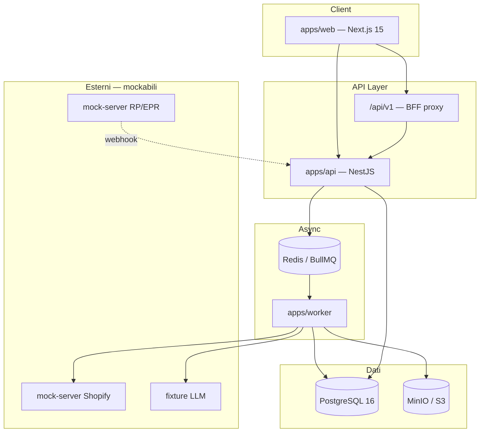
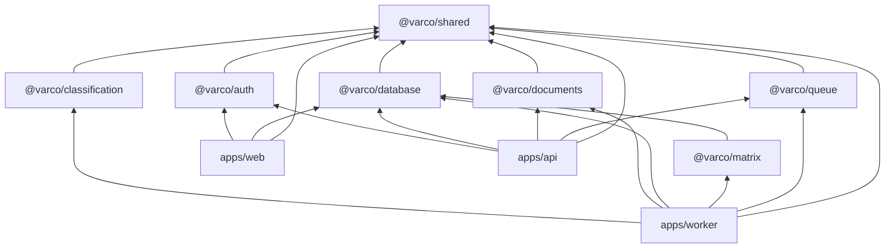
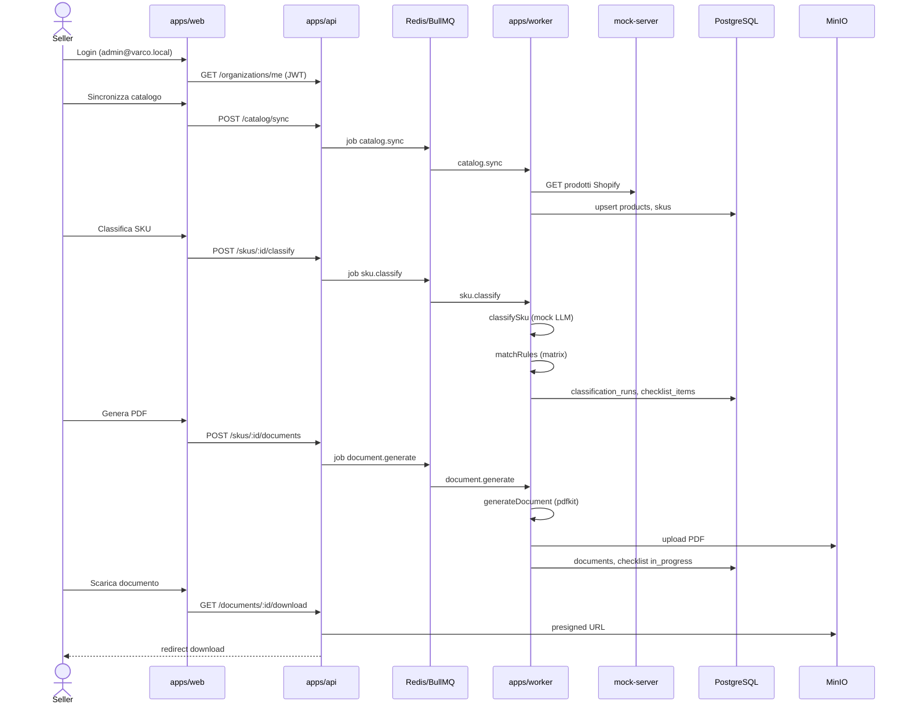
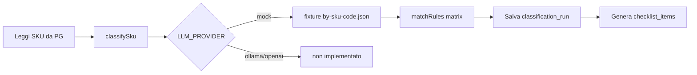
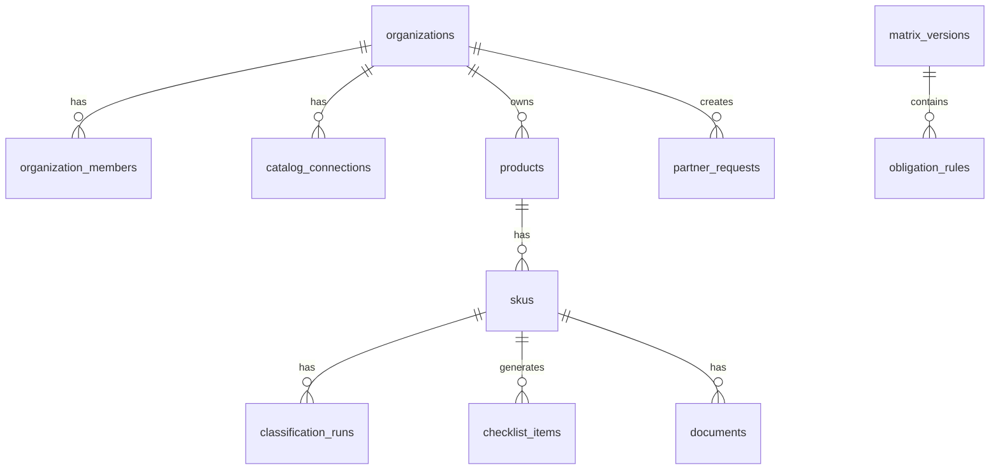
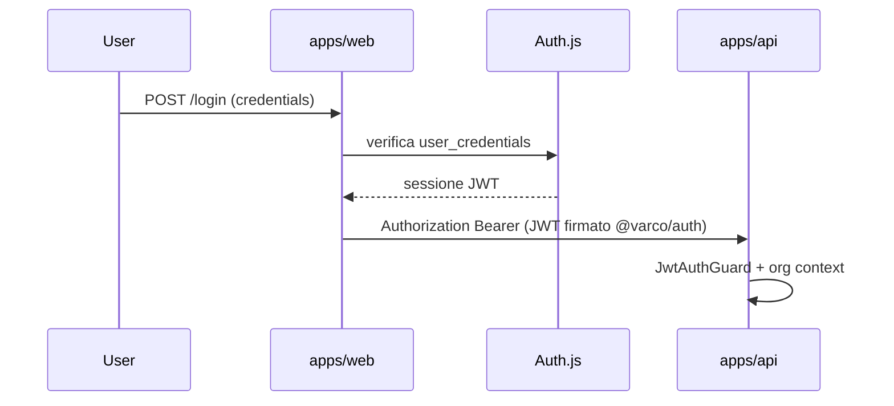

# Varco — Code map

Mappa del software: struttura del monorepo, flussi end-to-end, API, job asincroni, dati e integrazioni.  
Per lo stato di implementazione vedi [PROGRESS.md](./PROGRESS.md). Per il lavoro rimanente vedi [BACKLOG.md](./BACKLOG.md).

---

## 1. Principio guida

```
Catalogo → Classificazione AI (attributi) → Matrice obblighi (lookup) → Checklist → Documenti / Partner
```

**La matrice decide, l'AI non inventa.** L'LLM estrae attributi strutturati (categoria, materiali, età, mercati); gli obblighi derivano da righe verificate in `packages/matrix/data/`, non da output libero del modello.

---

## 2. Vista sistema



### Porte e URL (sviluppo locale)

| Servizio | URL | Ruolo |
|----------|-----|-------|
| Web | http://localhost:3000 | Dashboard seller |
| API | http://localhost:3001/api | REST + Swagger `/api/docs` |
| Mock server | http://localhost:4010 | Shopify, Amazon stub, partner |
| PostgreSQL | localhost:5432 | Dati applicativi |
| Redis | localhost:6379 | Code BullMQ |
| MinIO | http://localhost:9001 | PDF e allegati |
| Mailhog | http://localhost:8025 | Email dev (non cablata) |

---

## 3. Struttura monorepo

```
varco/
├── apps/
│   ├── web/                 # Dashboard Next.js (Auth.js, BFF, SSR)
│   ├── api/                 # REST NestJS (domini, enqueue job)
│   └── worker/              # Consumer BullMQ (sync, classify, PDF)
├── packages/
│   ├── auth/                # JWT API (sign/verify)
│   ├── database/            # Drizzle schema, migrations, seed
│   ├── matrix/              # YAML obblighi + engine matchRules
│   ├── classification/      # Pipeline LLM → attributi strutturati
│   ├── documents/           # Generazione PDF + upload S3
│   ├── queue/               # Enqueue job BullMQ
│   ├── shared/              # Costanti dominio, tipi job
│   └── tsconfig/            # Config TypeScript condivise
├── mocks/mock-server/       # Fastify: Shopify, Amazon stub, partner
├── fixtures/                # shopify-catalog.json, llm-classifications/
├── design/                  # Sistema visivo (Replit-inspired)
├── docs/images/             # Screenshot dashboard
├── docker-compose.yml       # Infra locale (non le app Node)
└── turbo.json               # Orchestrazione build/test/lint
```

### Grafo dipendenze (semplificato)



---

## 4. Flusso compliance end-to-end

### 4.1 Sequenza operativa (demo)



### 4.2 Script demo

```bash
docker compose up -d
pnpm db:migrate && pnpm db:seed && pnpm matrix:seed
pnpm dev                    # web + api + worker
pnpm demo:populate          # sync + classify + PDF su SKU demo
```

---

## 5. apps/web — Dashboard

### Route UI

| Route | Tipo | Descrizione |
|-------|------|-------------|
| `/login` | pubblica | Credenziali demo |
| `/` | protetta | Panoramica metriche e pipeline |
| `/catalog` | protetta | Connessioni marketplace + sync |
| `/skus` | protetta | Tabella SKU, classifica, genera PDF |
| `/checklist` | protetta | Obblighi per SKU × paese |

### Route API interne (Next.js)

| Route | Ruolo |
|-------|-------|
| `/api/auth/[...nextauth]` | Auth.js v5 — sessione JWT |
| `/api/v1/[...path]` | BFF proxy verso NestJS (GET/POST, Bearer JWT) |

### Pattern dati

- **SSR (server):** pagine dashboard chiamano NestJS direttamente via `src/lib/api.ts`
- **Mutazioni client:** `useApiPost` → `/api/v1/*` → NestJS (evita esporre token al browser)
- **Middleware:** `src/middleware.ts` reindirizza a `/login` senza sessione

---

## 6. apps/api — REST NestJS

Prefisso globale: `/api`. Documentazione OpenAPI: `/api/docs` (non in produzione).

### Endpoint implementati

| Metodo | Route | Auth | Comportamento |
|--------|-------|------|---------------|
| GET | `/health` | — | Health check |
| GET | `/organizations/me` | JWT | Contesto utente + organizzazione |
| GET | `/catalog/connections` | JWT | Connessioni marketplace |
| POST | `/catalog/sync` | JWT | Accoda `catalog.sync` |
| GET | `/skus` | JWT | Lista SKU organizzazione |
| POST | `/skus/:id/classify` | JWT | Accoda `sku.classify` |
| GET | `/skus/:id/classification` | JWT | Ultima classificazione |
| GET | `/checklist` | JWT | Voci checklist (`?skuId=` opzionale) |
| GET | `/skus/:skuId/documents` | JWT | Documenti generati |
| POST | `/skus/:skuId/documents` | JWT | Accoda `document.generate` |
| GET | `/documents/:id/download` | JWT | URL firmato MinIO |
| POST | `/internal/partner-webhook` | webhook secret | Ingest evento partner (audit) |

### Moduli NestJS

`health` · `organizations` · `catalog` · `skus` · `checklist` · `documents` · `partner` · `auth` (guard JWT globale) · `database` · `queue`

### Endpoint pianificati (non implementati)

Vedi [BACKLOG.md](./BACKLOG.md): `PATCH /checklist/:id`, `POST/GET /partner-requests`, API matrice admin, OAuth callback Shopify/Amazon.

---

## 7. apps/worker — Job BullMQ

Coda: **`varco`**. Retry: 3 tentativi, backoff esponenziale. Job ID deduplicati per entità.

| Job | Payload | Handler | Output |
|-----|---------|---------|--------|
| `catalog.sync` | `organizationId`, `connectionId?` | `catalog-sync.handler` | `products`, `skus` da mock Shopify |
| `sku.classify` | `organizationId`, `skuId` | `sku-classify.handler` | `classification_runs`, `checklist_items` |
| `document.generate` | `organizationId`, `skuId`, `templateId` | `document-generate.handler` | PDF in MinIO, riga `documents` |

### Flusso `sku.classify` (dettaglio)



### Flusso `catalog.sync` (dettaglio)

1. Legge `catalog_connections` per l'organizzazione
2. Se provider `shopify` + mock → `shopify-mock-client` → `MOCK_SERVER_URL`
3. Parsa tag `varco_category:`, `varco_markets:` sui prodotti
4. Upsert `products` e `skus`
5. Amazon e altri provider → errore «non ancora supportato»

---

## 8. packages — Dominio condiviso

| Package | Responsabilità chiave |
|---------|----------------------|
| `@varco/shared` | `MVP_COUNTRIES`, `MVP_PRODUCT_CATEGORIES`, nomi job, `DOCUMENT_TEMPLATE_IDS` |
| `@varco/database` | 18 tabelle Drizzle; CLI `db:migrate`, `db:seed` |
| `@varco/matrix` | `matrix-v0.yaml`, `matchRules()`, CLI `matrix:validate`, `matrix:seed` |
| `@varco/classification` | `classifySku()` — mock attivo; ollama/openai da implementare |
| `@varco/documents` | `generateDocument()` — solo template `risk_assessment` (pdfkit) |
| `@varco/queue` | `enqueueCatalogSync`, `enqueueSkuClassify`, `enqueueDocumentGenerate` |
| `@varco/auth` | `signApiAccessToken`, `verifyApiAccessToken` |

### Perimetro MVP (costanti)

- **5 paesi:** DE, FR, IT, ES, NL
- **5 categorie:** toys, apparel, electronics_accessories, cosmetics, home
- **6 tipi obbligo:** responsible_person, technical_file, declaration_of_conformity, labeling, epr_packaging, product_safety_assessment

---

## 9. Modello dati (PostgreSQL)

### Domini principali



### Tabelle (18)

| Dominio | Tabelle |
|---------|---------|
| Tenant | `organizations`, `users`, `organization_members`, `user_credentials` |
| Auth.js | `accounts`, `sessions`, `verification_tokens` |
| Catalogo | `catalog_connections`, `products`, `skus` |
| Matrice | `matrix_versions`, `obligation_rules`, `rule_change_logs` |
| Compliance | `classification_runs`, `checklist_items`, `documents` |
| Partner | `partner_requests`, `partner_webhook_events` |

### Migration

| File | Contenuto |
|------|-----------|
| `0000_init.sql` | Schema core |
| `0001_auth.sql` | Tabelle Auth.js |
| `0002_rls.sql` | Row Level Security (policy definite, **non cablate in app**) |

---

## 10. Integrazioni esterne

| Integrazione | Stato attuale | Config env | Implementazione |
|--------------|---------------|------------|-----------------|
| Shopify | **mock** | `SHOPIFY_API_MODE=mock` | `mocks/mock-server` + worker client |
| Amazon SP-API | **stub** | `AMAZON_API_MODE=mock` | Endpoint vuoto su mock-server |
| LLM | **mock** | `LLM_PROVIDER=mock` | `fixtures/llm-classifications/` |
| LLM Ollama | pianificato | `LLM_PROVIDER=ollama` | throw in `classify.ts` |
| LLM OpenAI | pianificato | `LLM_PROVIDER=openai` | throw in `classify.ts` |
| MinIO/S3 | **reale** (locale) | `S3_*` in `.env` | `@varco/documents` via AWS SDK |
| Partner RP/EPR | **mock** | `PARTNER_API_MODE=mock` | mock-server + webhook simulato |
| Redis | **reale** (locale) | `REDIS_URL` | BullMQ |
| PostgreSQL | **reale** (locale) | `DATABASE_URL` | Drizzle |
| Mailhog | infra only | — | Nessun flusso email in app |

### mock-server (porta 4010)

| Route | Simula |
|-------|--------|
| `/shopify/oauth/*` | OAuth Shopify |
| `/shopify/admin/api/*` | Admin API prodotti |
| `/amazon/sp-api/*` | Amazon (stub vuoto) |
| `/partners/*` | Richieste RP/EPR + webhook verso Varco dopo 5s |

---

## 11. Auth e sicurezza



- Login: credenziali in `user_credentials` (seed demo)
- API: guard JWT globale; eccezioni: `/health`, `/internal/partner-webhook`
- Webhook partner: header secret (`WEBHOOK_SECRET`)
- Rate limiting: ThrottlerModule NestJS
- RLS Postgres: migration presente, isolamento tenant oggi a livello applicativo

---

## 12. CI e comandi utili

| Comando | Effetto |
|---------|---------|
| `pnpm dev` | Avvia web + api + worker (Turbo) |
| `pnpm build` | Build tutti i package |
| `pnpm test` | Test unitari |
| `pnpm lint` | ESLint |
| `pnpm matrix:validate` | Valida YAML matrice |
| `pnpm matrix:seed` | Carica regole in DB |
| `pnpm mock:dev` | Mock server senza Docker |
| `pnpm worker:enqueue-demo-sync` | Accoda sync demo |

GitHub Actions (`.github/workflows/ci.yml`): lint, test, typecheck, matrix validate, build.

---

## Collegamenti

- [README](./README.md) — panoramica prodotto e quick start
- [ARCHITECTURE.md](./ARCHITECTURE.md) — decisioni architetturali e modello target
- [PROGRESS.md](./PROGRESS.md) — cosa è stato completato
- [BACKLOG.md](./BACKLOG.md) — cosa manca
- [CONTRIBUTING.md](./CONTRIBUTING.md) — setup sviluppatore
- [design/replit/DESIGN.md](./design/replit/DESIGN.md) — UI dashboard
