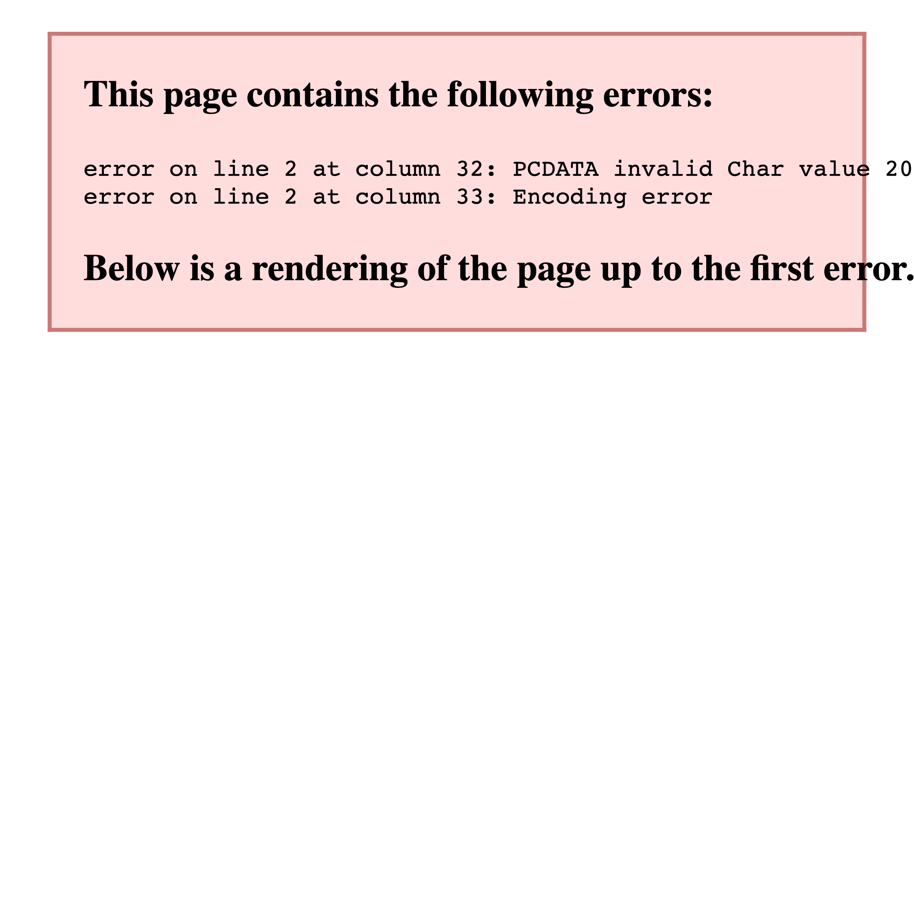

# Varco

AI compliance copilot for selling in Europe — turning EU product regulations (GPSR, EPR, labelling, PPWR) into actionable SKU checklists and document drafts.

> **Repository status:** finished technical **demo / proof-of-concept**. Local end-to-end flow with **mocks only** (Shopify, LLM, partners). Not a production product. Optional future ideas: [BACKLOG.md](./BACKLOG.md) (Italian).

## Readme by language

Demo markets: DE, FR, IT, ES, NL. Choose your language:

|     | Language   | README                         |
| --- | ---------- | ------------------------------ |
| 🇮🇹  | Italiano   | [README.md](./README.md)       |
| 🇩🇪  | Deutsch    | [README.de.md](./README.de.md) |
| 🇫🇷  | Français   | [README.fr.md](./README.fr.md) |
| 🇪🇸  | Español    | [README.es.md](./README.es.md) |
| 🇳🇱  | Nederlands | [README.nl.md](./README.nl.md) |

The cover image (`docs/cover.png`) and screenshots are shared across all language READMEs.

## Technical documentation

Project docs (CODEMAP, PROGRESS, BACKLOG, ARCHITECTURE, CONTRIBUTING) are in Italian. Design tokens are in English.

| Document                                             | Description                                                  |
| ---------------------------------------------------- | ------------------------------------------------------------ |
| [GUIDA.md](./GUIDA.md) · [/guida](http://localhost:3000/guida) | Interactive visual project guide (open with `pnpm dev`) |
| [CODEMAP.md](./CODEMAP.md)                           | End-to-end software flow, API, worker, DB, integrations      |
| [PROGRESS.md](./PROGRESS.md)                         | Finished demo — implementation history                       |
| [BACKLOG.md](./BACKLOG.md)                           | Optional post-demo roadmap                                   |
| [ARCHITECTURE.md](./ARCHITECTURE.md)                 | System architecture, domains, decisions, data model          |
| [design/README.md](./design/README.md)               | Visual reference system (Replit-inspired)                    |
| [design/replit/DESIGN.md](./design/replit/DESIGN.md) | Color tokens, typography, UI components                        |
| [CONTRIBUTING.md](./CONTRIBUTING.md)                 | Development setup, code standards, PR process                |

## License

Proprietary software — all rights reserved. This material (code and documentation) is confidential and intended exclusively for internal evaluation of the Varco project. No agreement, partnership, or commercial commitment with marketplaces, compliance partners (RP/EPR), regulatory consultants, or third parties is implied by this repository.

See [LICENSE](./LICENSE) for full terms.
