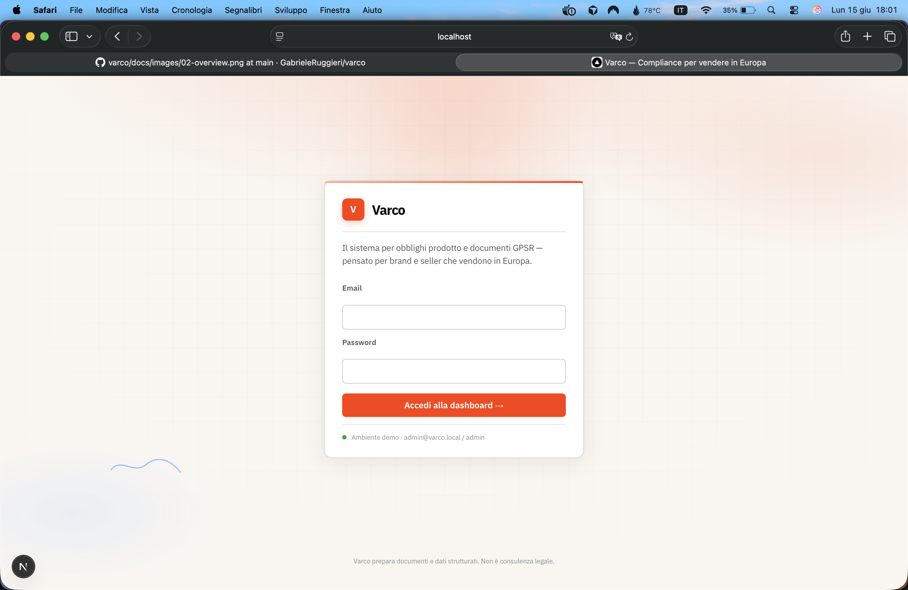
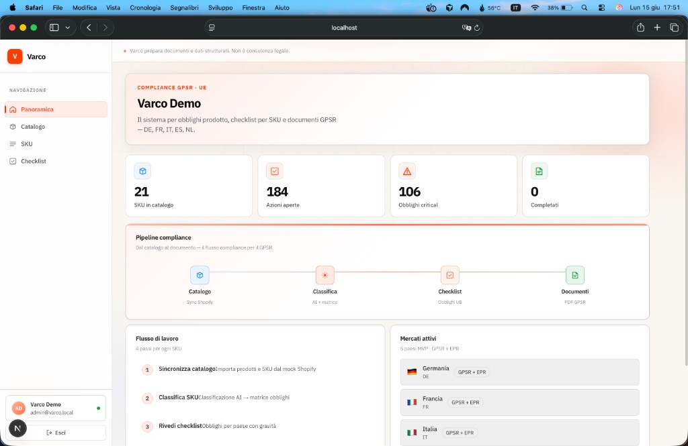
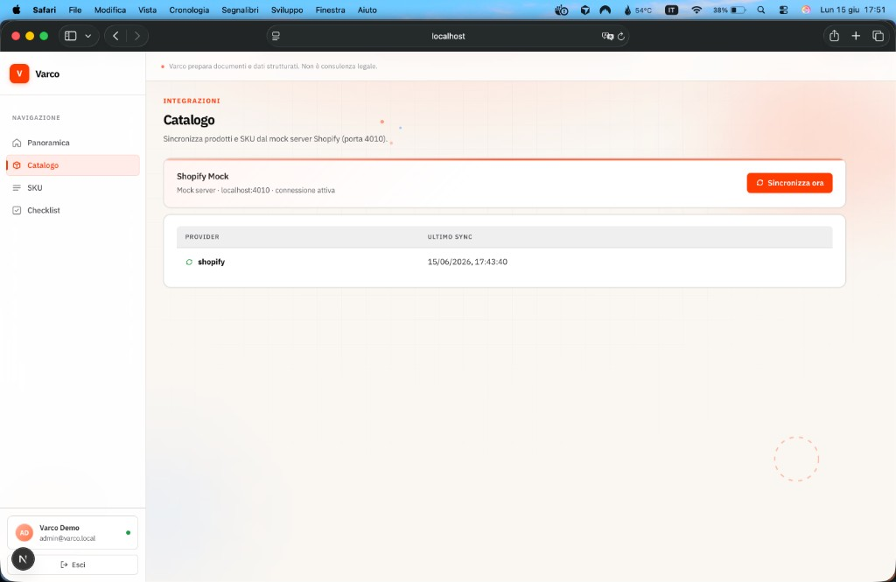
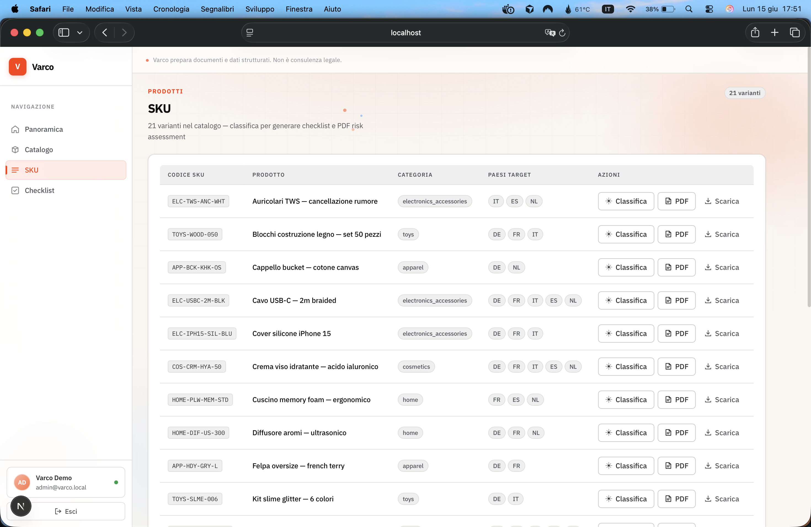
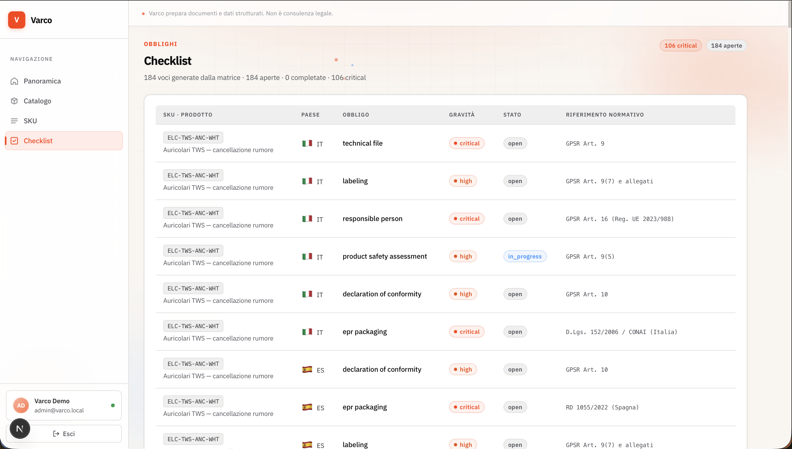

# Varco

**Copilot AI di compliance per vendere in Europa.**

> **Stato del repository:** demo tecnica / proof-of-concept **conclusa**. Flusso end-to-end locale con **solo mock** (Shopify, LLM, partner). Non è un prodotto in produzione né un MVP commercializzabile. La roadmap eventuale è in [BACKLOG.md](./BACKLOG.md).

Varco trasforma le normative europee sui prodotti (GPSR, EPR, etichettatura, PPWR) in una checklist operativa per SKU, con bozze di documenti generate da template — così brand e seller possono espandere la vendita cross-border nell'UE senza navigare da soli decine di portali e consulenti frammentati.

> **Importante:** Varco supporta la _preparazione_ di documenti e dati strutturati. Non è consulenza legale e non certifica la conformità del prodotto. Ogni output include disclaimer espliciti.

## Altre lingue

|     | Lingua     | README                         |
| --- | ---------- | ------------------------------ |
| 🇬🇧  | English    | [README.en.md](./README.en.md) |
| 🇩🇪  | Deutsch    | [README.de.md](./README.de.md) |
| 🇫🇷  | Français   | [README.fr.md](./README.fr.md) |
| 🇪🇸  | Español    | [README.es.md](./README.es.md) |
| 🇳🇱  | Nederlands | [README.nl.md](./README.nl.md) |

---

## Problema

Dal dicembre 2024 il **GPSR** (General Product Safety Regulation) ha reso obbligatori, per ogni prodotto immesso sul mercato UE, requisiti come il Responsible Person, il fascicolo tecnico, la dichiarazione di conformità, l'etichettatura a norma e le registrazioni **EPR** imballaggi paese per paese. Il **PPWR** aggiunge ulteriori obblighi a partire dal 2026.

Gli obblighi sono per **paese**, per **categoria di prodotto**, e cambiano nel tempo. Le alternative attuali — consulenti costosi, servizi mono-obbligo, o rinunciare al mercato europeo — non scalano su cataloghi con decine o centinaia di SKU.

## Per chi è pensato

Brand D2C e seller su marketplace (Shopify, Amazon, Etsy) con cataloghi da 10 a 500 SKU che vendono o vogliono vendere verso l'UE: giocattoli, cosmetica, accessori elettronici, abbigliamento, articoli per la casa.

## Cosa fa

| Funzionalità                  | Cosa fa la demo                                                                                                                                                     |
| ----------------------------- | ------------------------------------------------------------------------------------------------------------------------------------------------------------------- |
| **Scansione catalogo**        | Sync da **mock Shopify** (fixture ~21 SKU): titoli, materiali, categorie e mercati target                                                                           |
| **Classificazione SKU**       | Provider LLM **mock** (fixture): attributi strutturati; gli obblighi derivano dalla **matrice**, non dall'output libero del modello                                 |
| **Checklist per paese**       | Obblighi con gravità e stato operativo per SKU × paese (DE, FR, IT, ES, NL)                                                                                         |
| **Generatore documenti GPSR** | Bozza PDF **risk assessment** (template toys) → MinIO                                                                                                               |
| **Partner RP/EPR**            | Mock-server simula webhook; ingest in API (orchestrazione completa fuori perimetro demo)                                                                            |

### Perimetro demo (congelato)

- **5 categorie** × **5 paesi**: giocattoli, tessile, accessori elettronici, cosmetica, casa × Germania, Francia, Italia, Spagna, Paesi Bassi
- Catalogo: mock Shopify (`SHOPIFY_API_MODE=mock`) — nessun OAuth live
- Classificazione: solo `LLM_PROVIDER=mock` (Ollama/OpenAI non implementati)
- Matrice obblighi versionata in **bozza** (12 regole seed) con disclaimer
- Documenti: un template PDF (`risk_assessment`)

Idee oltre la demo (connettori live, più template, radar 27 paesi, ecc.): [BACKLOG.md](./BACKLOG.md).

## Come funziona (in sintesi)

```
Catalogo → Classificazione AI (attributi) → Matrice obblighi (lookup) → Checklist → Documenti / Partner
```

**Principio architetturale:** la matrice decide, l'AI non inventa. Il modello classifica e redige testi; la determinazione normativa è lookup su dati verificati.

Per il dettaglio tecnico vedi [ARCHITECTURE.md](./ARCHITECTURE.md). Per il flusso completo del software (API, worker, dati, integrazioni) vedi [CODEMAP.md](./CODEMAP.md).

## Guida alla dashboard

Il flusso operativo in cinque schermate — dalla login alla checklist obblighi per paese.

### 1. Accesso

Accedi con le credenziali demo per entrare nella dashboard organizzazione.



### 2. Panoramica

La home riassume lo stato del catalogo: SKU importati, azioni aperte, obblighi critical e completati. La **pipeline compliance** mostra i quattro passi del flusso; i **mercati attivi** elencano i paesi MVP (DE, FR, IT, ES, NL).



### 3. Sincronizza catalogo

Collega il mock Shopify (porta 4010) e importa prodotti e varianti SKU nel database Varco. Ogni sync aggiorna titoli, materiali, categorie e paesi target estratti dai tag.



### 4. Classifica SKU

Per ogni variante puoi avviare la **classificazione AI**: il modello estrae attributi strutturati e la **matrice obblighi** (non l'LLM) determina i requisiti. Da qui si generano anche i PDF risk assessment GPSR.



### 5. Rivedi checklist

Le voci generate dalla matrice compaiono per **SKU × paese**: tipo obbligo (fascicolo tecnico, etichettatura, RP, EPR…), **gravità** (critical / high / …), stato operativo e riferimento normativo (es. GPSR Art. 9, CONAI).



## Stack tecnologico

| Componente | Tecnologia                                        |
| ---------- | ------------------------------------------------- |
| Monorepo   | pnpm + Turborepo                                  |
| Frontend   | Next.js 15, TypeScript                            |
| API        | NestJS                                            |
| Worker     | BullMQ + Redis                                    |
| Database   | PostgreSQL 16, Drizzle ORM                        |
| Auth       | Auth.js v5                                        |
| Storage    | MinIO (locale)                                    |
| LLM        | Mock (fixture); contratto astratto per eventuali provider futuri |

## Avvio rapido

Demo locale completa in pochi minuti.

### Prerequisiti

- Docker Desktop
- Node.js ≥ 20
- pnpm ≥ 9

### Setup

```bash
git clone https://github.com/GabrieleRuggieri/varco.git
cd varco
pnpm install
cp .env.example .env
docker compose up -d
pnpm db:migrate
pnpm db:seed
pnpm matrix:seed
pnpm dev
```

In un secondo terminale, con `pnpm dev` attivo, popola catalogo, checklist e PDF demo:

```bash
pnpm demo:populate
```

| Servizio | URL                   |
| -------- | --------------------- |
| Web      | http://localhost:3000 |
| API      | http://localhost:3001 |
| Mailhog  | http://localhost:8025 |
| MinIO    | http://localhost:9001 |

Con `LLM_PROVIDER=mock` e `SHOPIFY_API_MODE=mock` non servono chiavi API esterne per lo sviluppo locale.

**Dashboard demo:** http://localhost:3000 — login `admin@varco.local` / `admin` (dopo `pnpm db:seed`).  
Per riempire catalogo, checklist e PDF: `pnpm demo:populate` (con `pnpm dev` attivo).

Guida completa per chi contribuisce: [CONTRIBUTING.md](./CONTRIBUTING.md).

## Struttura del repository

```
varco/
├── apps/
│   ├── web/          # Dashboard Next.js
│   ├── api/          # Backend REST
│   └── worker/       # Job asincroni
├── packages/
│   ├── auth/         # JWT e sessioni
│   ├── database/     # Schema e migrations (Drizzle)
│   ├── matrix/       # Matrice obblighi (YAML + validazione)
│   ├── classification/ # Pipeline AI → attributi strutturati
│   ├── documents/    # Template e generazione PDF GPSR
│   ├── queue/        # BullMQ job definitions
│   └── shared/       # Utility condivise
├── mocks/
│   └── mock-server/  # API mock (Shopify, Amazon, Partner)
├── fixtures/         # Dati di test
├── docker/           # Postgres init scripts
└── docker-compose.yml
```

## Glossario

| Termine  | Significato                                                                                      |
| -------- | ------------------------------------------------------------------------------------------------ |
| **GPSR** | Regolamento generale sulla sicurezza dei prodotti (UE), in vigore dal dicembre 2024              |
| **EPR**  | Extended Producer Responsibility — registrazione e contributi per imballaggi/prodotti, per paese |
| **PPWR** | Regolamento UE sugli imballaggi e sui rifiuti di imballaggio                                     |
| **RP**   | Responsible Person — soggetto stabilito nell'UE responsabile della conformità                    |
| **DoC**  | Dichiarazione di Conformità                                                                      |
| **SKU**  | Singolo articolo a catalogo                                                                      |

## Licenza

Software proprietario — tutti i diritti riservati. Questo materiale (codice e documentazione) è confidenziale e destinato esclusivamente alla valutazione interna del progetto Varco. Nessun accordo, partnership o impegno commerciale con marketplace, partner di compliance (RP/EPR), consulenti normativi o terzi è implicato da questo repository.

Vedi [LICENSE](./LICENSE) per i termini completi.

## Documentazione

| Documento                                            | Contenuto                                                    |
| ---------------------------------------------------- | ------------------------------------------------------------ |
| [GUIDA.md](./GUIDA.md) · [/guida](http://localhost:3000/guida) | Guida visiva interattiva al progetto (apri con `pnpm dev`) |
| [CODEMAP.md](./CODEMAP.md)                           | Flusso software end-to-end, API, worker, DB, integrazioni    |
| [PROGRESS.md](./PROGRESS.md)                         | Demo conclusa — cronologia di implementazione                |
| [BACKLOG.md](./BACKLOG.md)                           | Roadmap post-demo (opzionale, non bloccante)                 |
| [ARCHITECTURE.md](./ARCHITECTURE.md)                 | Architettura di sistema, domini, decisioni, modello dati     |
| [design/README.md](./design/README.md)               | Sistema visivo di riferimento (Replit-inspired)              |
| [design/replit/DESIGN.md](./design/replit/DESIGN.md) | Token colori, tipografia, componenti UI                      |
| [CONTRIBUTING.md](./CONTRIBUTING.md)                 | Setup sviluppo, standard di codice, processo PR              |
