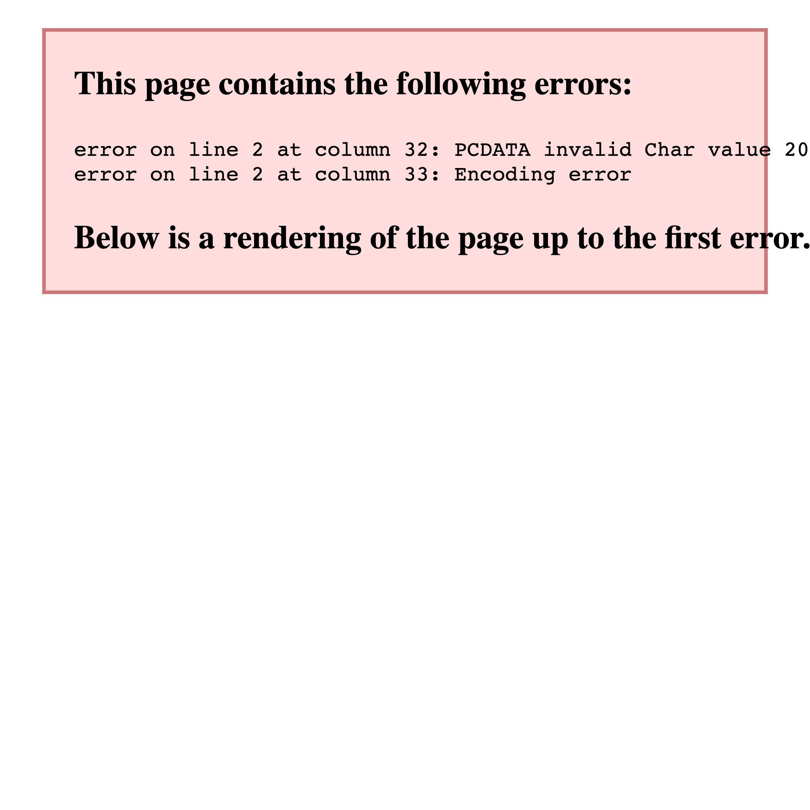
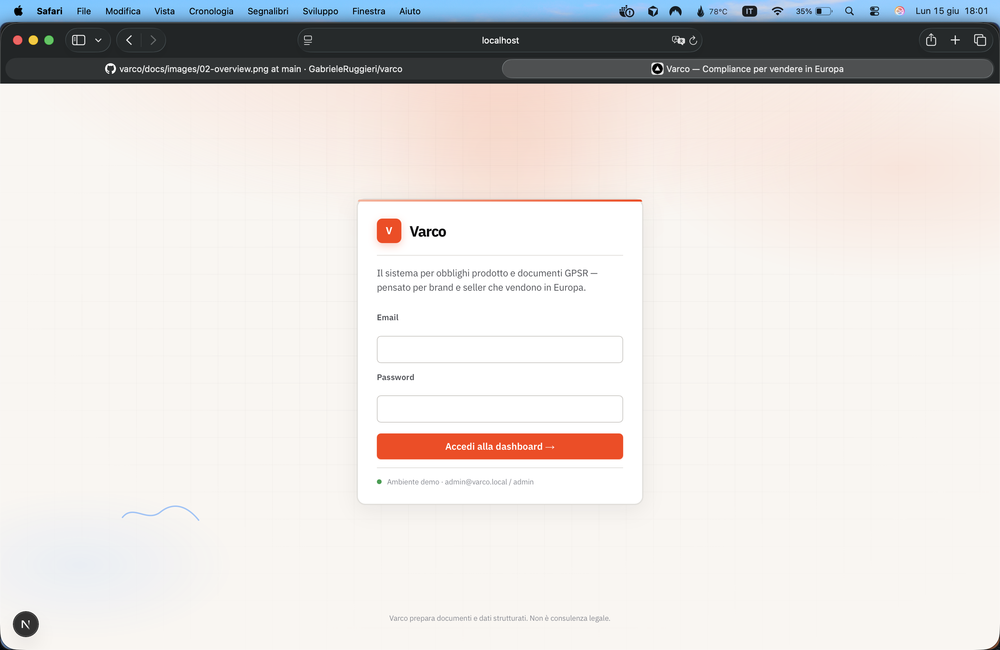
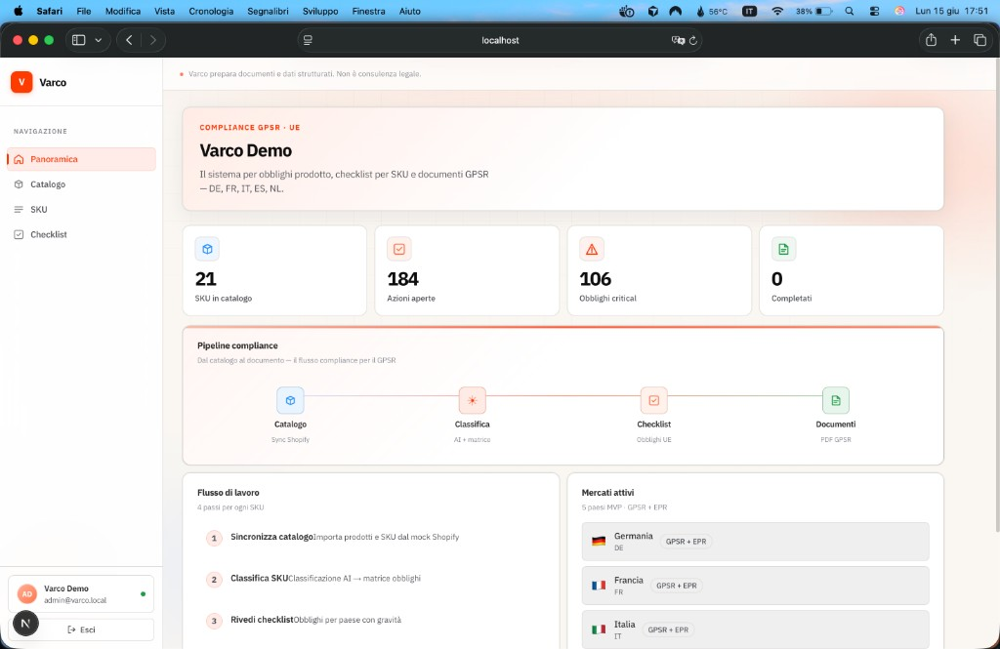
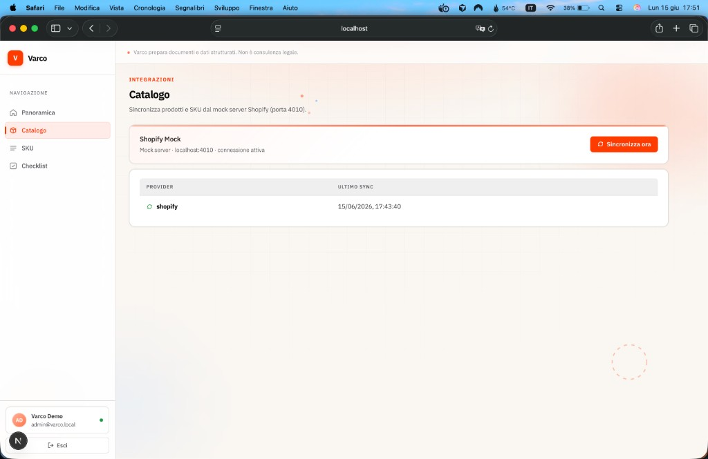
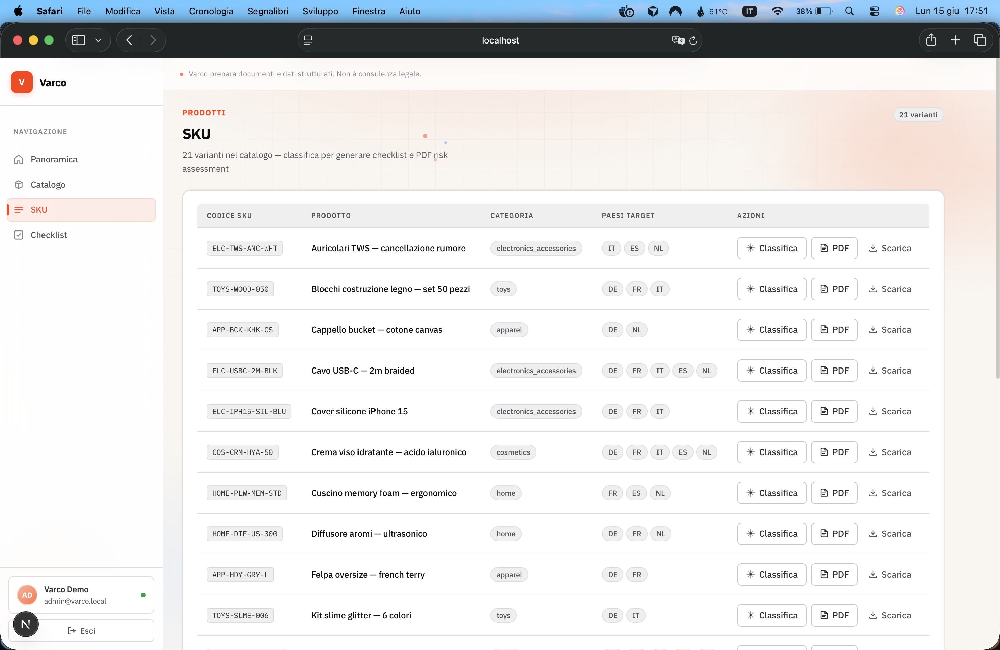
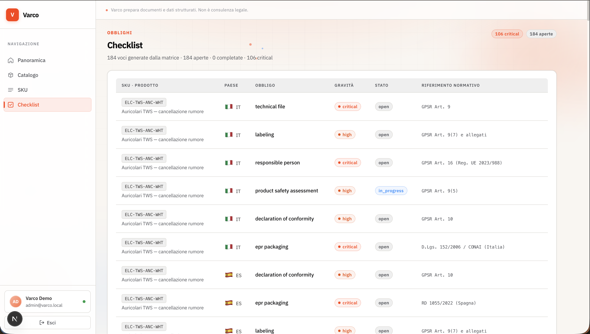

# Varco

**AI-compliancecopilot voor verkopen in Europa.**

Varco zet Europese productregelgeving (GPSR, EPR, etikettering, PPWR) om in een operationele checklist per SKU, met conceptdocumenten gegenereerd uit gecontroleerde sjablonen — zodat merken en verkopers grensoverschrijdende verkoop in de EU kunnen uitbreiden zonder alleen tientallen gefragmenteerde portalen en adviseurs te moeten doorlopen.

> **Belangrijk:** Varco ondersteunt de _voorbereiding_ van documenten en gestructureerde data. Het is geen juridisch advies en certificeert de productconformiteit niet. Elke output bevat expliciete disclaimers.

---

## Probleem

Sinds december 2024 maakt de **GPSR** (General Product Safety Regulation) voor elk product dat op de EU-markt wordt gebracht vereisten verplicht zoals Responsible Person, technisch dossier, conformiteitsverklaring, conforme etikettering en **EPR**-verpakkingsregistraties per land. De **PPWR** voegt vanaf 2026 extra verplichtingen toe.

De verplichtingen gelden per **land**, per **productcategorie**, en veranderen in de loop van de tijd. De huidige alternatieven — dure consultants, diensten voor één verplichting, of afzien van de Europese markt — schalen niet voor catalogi met tientallen of honderden SKU's.

## Voor wie

D2C-merken en marketplace-verkopers (Shopify, Amazon, Etsy) met catalogi van 10 tot 500 SKU's die in de EU verkopen of willen verkopen: speelgoed, cosmetica, elektronische accessoires, kleding, huishoudelijke artikelen.

## Wat Varco doet

| Functionaliteit            | Beschrijving                                                                                                                                                                         |
| -------------------------- | ------------------------------------------------------------------------------------------------------------------------------------------------------------------------------------ |
| **Catalogusscan**          | Koppeling met Shopify/Amazon; import van titels, beschrijvingen, materialen, afbeeldingen en doelmarkten                                                                             |
| **SKU-classificatie**      | AI extraheert gestructureerde attributen (categorie, materialen, leeftijd, enz.); verplichtingen komen uit een **door experts samengestelde matrix**, niet uit vrije modeloutput     |
| **Checklist per land**     | Verplichtingen met ernst, deadlines en operationele status — van «27 landen juridisch jargon» naar «jouw N acties»                                                                   |
| **GPSR-documentgenerator** | Concepten voor risicobeoordeling, technisch dossier, conformiteitsverklaring, etiketteringselementen — uit categorie-specifieke sjablonen                                            |
| **RP en EPR via partners** | Orchestratie van benoeming Responsible Person en registraties bij producentenverantwoordelijkheidsorganisaties via geïntegreerde partners (Varco coördineert, levert de dienst niet) |

### MVP-scope (v1)

- **5 categorieën** × **5 landen**: speelgoed, textiel, elektronische accessoires, cosmetica, huishouden × Duitsland, Frankrijk, Italië, Spanje, Nederland
- Cataloguskoppeling (Shopify prioriteit; Amazon in latere fase)
- Geversioneerde verplichtingenmatrix met workflow voor regelgevingsreview
- Abstracte LLM-provider: mock in CI, Ollama optioneel in lokale ontwikkeling

Gepland in latere releases: regelgevingsradar voor 27 landen, marketplace-schild (attribuutsync), WEEE/batterijen, workspace voor bureaus. Details in [BACKLOG.md](./BACKLOG.md).

## Hoe het werkt (kort)

```
Catalogus → AI-classificatie (attributen) → Verplichtingenmatrix (lookup) → Checklist → Documenten / Partners
```

**Architectuurprincipe:** de matrix beslist, de AI verzint niets. Het model classificeert en redigeert teksten; de regelgevingsbepaling is lookup op geverifieerde data.

Voor technische details, zie [ARCHITECTURE.md](./ARCHITECTURE.md). Voor de volledige softwareflow (API, worker, data, integraties), zie [CODEMAP.md](./CODEMAP.md).

## Dashboardgids

De operationele flow in vijf schermen — van login tot verplichtingen-checklist per land.

### 1. Toegang

Log in met de demo-credentials om het organisatiedashboard te openen.



### 2. Overzicht

De startpagina vat de catalogusstatus samen: geïmporteerde SKU's, open acties, critical en voltooide verplichtingen. De **compliance-pipeline** toont de vier stappen van de flow; de **actieve markten** tonen de MVP-landen (DE, FR, IT, ES, NL).



### 3. Catalogus synchroniseren

Koppel de mock Shopify (poort 4010) en importeer producten en SKU-varianten in de Varco-database. Elke sync werkt titels, materialen, categorieën en uit tags geëxtraheerde doellanden bij.



### 4. SKU's classificeren

Per variant kun je **AI-classificatie** starten: het model extraheert gestructureerde attributen en de **verplichtingenmatrix** (niet de LLM) bepaalt de vereisten. Vanaf hier worden ook GPSR-risicobeoordelings-PDF's gegenereerd.



### 5. Checklist bekijken

Items uit de matrix verschijnen per **SKU × land**: type verplichting (technisch dossier, etikettering, RP, EPR…), **ernst** (critical / high / …), operationele status en regelgevingsreferentie (bijv. GPSR Art. 9, CONAI).



## Technologiestack

| Component | Technologie                                        |
| --------- | -------------------------------------------------- |
| Monorepo  | pnpm + Turborepo                                   |
| Frontend  | Next.js 15, TypeScript                             |
| API       | NestJS                                             |
| Worker    | BullMQ + Redis                                     |
| Database  | PostgreSQL 16, Drizzle ORM                         |
| Auth      | Auth.js v5                                         |
| Storage   | MinIO (lokaal) / S3 (productie)                    |
| LLM       | Abstracte provider: `mock` \| `ollama` \| `openai` |

## Snelstart

Volledige lokale demo in enkele minuten.

### Vereisten

- Docker Desktop
- Node.js ≥ 20
- pnpm ≥ 9

### Setup

```bash
git clone https://github.com/GabrieleRuggieri/varco.git
cd varco
pnpm install
cp .env.example .env
docker compose up -d
pnpm db:migrate
pnpm db:seed
pnpm matrix:seed
pnpm dev
```

In een tweede terminal, met `pnpm dev` actief, catalogus, checklist en demo-PDF's vullen:

```bash
pnpm demo:populate
```

| Service | URL                   |
| ------- | --------------------- |
| Web     | http://localhost:3000 |
| API     | http://localhost:3001 |
| Mailhog | http://localhost:8025 |
| MinIO   | http://localhost:9001 |

Met `LLM_PROVIDER=mock` en `SHOPIFY_API_MODE=mock` zijn geen externe API-sleutels nodig voor lokale ontwikkeling.

**Demo-dashboard:** http://localhost:3000 — login `admin@varco.local` / `admin` (na `pnpm db:seed`).  
Om catalogus, checklist en PDF's te vullen: `pnpm demo:populate` (met `pnpm dev` actief).

Volledige gids voor bijdragers: [CONTRIBUTING.md](./CONTRIBUTING.md).

## Repositorystructuur

```
varco/
├── apps/
│   ├── web/          # Next.js-dashboard
│   ├── api/          # REST-backend
│   └── worker/       # Asynchrone jobs
├── packages/
│   ├── auth/         # JWT en sessies
│   ├── database/     # Schema en migraties (Drizzle)
│   ├── matrix/       # Verplichtingenmatrix (YAML + validatie)
│   ├── classification/ # AI-pipeline → gestructureerde attributen
│   ├── documents/    # Sjablonen en GPSR-PDF-generatie
│   ├── queue/        # BullMQ jobdefinities
│   └── shared/       # Gedeelde utilities
├── mocks/
│   └── mock-server/  # Mock-API (Shopify, Amazon, Partners)
├── fixtures/         # Testdata
├── docker/           # Postgres init-scripts
└── docker-compose.yml
```

## Woordenlijst

| Term     | Betekenis                                                                                         |
| -------- | ------------------------------------------------------------------------------------------------- |
| **GPSR** | EU-verordening algemene productveiligheid, van kracht sinds december 2024                         |
| **EPR**  | Extended Producer Responsibility — registratie en bijdragen voor verpakkingen/producten, per land |
| **PPWR** | EU-verordening over verpakkingen en verpakkingsafval                                              |
| **RP**   | Responsible Person — in de EU gevestigde entiteit verantwoordelijk voor conformiteit              |
| **DoC**  | Conformiteitsverklaring (Declaration of Conformity)                                               |
| **SKU**  | Individueel catalogusartikel                                                                      |

## Licentie

Proprietary software — alle rechten voorbehouden. Dit materiaal (code en documentatie) is vertrouwelijk en uitsluitend bedoeld voor interne evaluatie van het Varco-project. Geen overeenkomst, partnerschap of commerciële verplichting met marketplaces, compliance-partners (RP/EPR), regelgevingsadviseurs of derden wordt geïmpliceerd door deze repository.

Volledige voorwaarden: [LICENSE](./LICENSE).

## Documentatie

| Document                                             | Inhoud                                                         |
| ---------------------------------------------------- | -------------------------------------------------------------- |
| [CODEMAP.md](./CODEMAP.md)                           | End-to-end softwareflow, API, worker, DB, integraties        |
| [PROGRESS.md](./PROGRESS.md)                         | Implementatiestatus en sessiegeschiedenis                      |
| [BACKLOG.md](./BACKLOG.md)                           | Geprioriteerd resterend werk (MVP → post-MVP)                  |
| [ARCHITECTURE.md](./ARCHITECTURE.md)                 | Systeemarchitectuur, domeinen, beslissingen, datamodel         |
| [design/README.md](./design/README.md)               | Visueel referentiesysteem (Replit-inspired)                    |
| [design/replit/DESIGN.md](./design/replit/DESIGN.md) | Kleurtokens, typografie, UI-componenten                        |
| [CONTRIBUTING.md](./CONTRIBUTING.md)                 | Ontwikkel-setup, codestandaarden, PR-proces                    |
